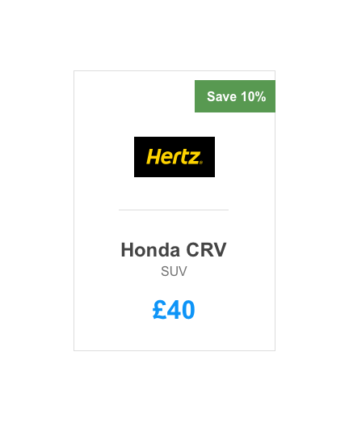
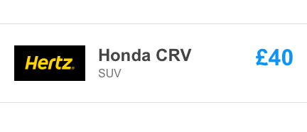

# Frontend developers interview exercise

___

Here at Rentalcars.com we embrace a collaborative working culture and we like to communicate and share our work as much as possible. Therefore, we encourage you to communicate your thoughts and ideas as you go along. If you are not sure about anything or need some guidance feel free to ask questions. We are here to help you.

Above all else, this exercise should not be about trying to finish every task or how fast you can do it, but mainly about the way you work and how you do it. Therefore, feel free to use any online resources you want such as any online APIs, Google, StackOverflow, etc.

___

## Exercise Steps:
#### 1) Create a car panel
Using HTML and CSS (or SASS if your prefer), create the car panel below.




#### 2) Update the values dynamically
Add a button to the page that when pressed, updates the values in the panel.


Change the details to match the following:

| Field         | Value         |
| ------------- |:-------------:|
| Supplier      | Avis          |
| Vehicle       | Ford Ka       |
| Type          | Compact       |
| Price         | 28.50         |


#### 3) Load the details from an external endpoint
There is an API endpoint setup at `http://localhost:3000/api/cars` which provides you with a JSON response with a list of 5 vehicles when hit with a GET request; The vehicle information is randomly generated every time you hit the endpoint. An example response from the endpoint looks like the following:
```JSON
{
  "discount_percentage": 10,
  "results": [
    {
      "make_model": "Vauxhall Insignia",
      "type": "Estate",
      "provider": "enterprise",
      "price": 50.96
    },
    {
      "make_model": "Ford Ka",
      "type": "Compact",
      "provider": "enterprise",
      "price": 64.7
    },
    {
      "make_model": "Vauxhall Corsa",
      "type": "Compact",
      "provider": "avis",
      "price": 45.52
    },
    {
      "make_model": "Ford Fiesta",
      "type": "Compact",
      "provider": "budget",
      "price": 34.9
    },
    {
      "make_model": "Audi A3",
      "type": "Compact",
      "provider": "avis",
      "price": 45.75
    }
  ]
}
```

Alter the way in which the details are changed in the car panel on the button press (as per the previous task) by obtaining the new details from the endpoint. You can choose any vehicle in the list to retrieve the information from but importantly, you should be able to see different details in the car panel each and every time you press the button.

The price displayed on the page should be calculated based on the vehicles original price and the discount_percentage: The resultant price should be equal to the `(100 - discount_percentage)%` of the vehicles original price.


#### 4) Add animation and visual effects to the car panel
Add some animations and visual effects to the car panel which should occur every time the button is pressed. Examples of animations include (but aren't limited to):
 - Fade out and fade back in
 - Flip the car panel
 - Wipe animation on the contents of the car panel


#### 5) Add new car panels to the page dynamically
Change the button press logic so that a new car panel should be added to the page with the relevant details (from the endpoint) instead of updating the same hardcoded car panel.

Feel free to use any UI frameworks (or UI portions of more monolothic frameworks) here if you so wish such as:
 - Angular (1/2)
 - Vue.js
 - React


#### 6) Make the page / car panels responsive
Make the page and all contained car panels responsive in nature and therefore optimised for mobile devices and form factors. If the page is narrow enough in width (more akin to phone and portable device form factors) then the look-and-feel of the panel should change to appear more like a list item.




#### 7) Group the car panels by type dynamically
All of the car panels have a type property which categorises the type of vehicle they represent (e.g. SUV, Compact, Luxury, etc.). Change the logic on the button press so that all new car panels added to the page are grouped by this type property visually.


___

### Paths and API reference:

- **/resources/css**
 - All files located in `dist/css` are served from here


- **/resources/js**
 - All files located in `dist/js` are served from here


- **/resources/images**
 - All files located in `dist/images` are served from here


- **/api/cars**
 - Returns a JSON object which contains a `discount_percentage` property and a `results` property
   - discount_percentage is an `integer` which can be between 0-20
   - results is an `array` of JSON objects, each representing a vehicle
     - make_model is a `string` with the make and model of a vehicle
     - type is an (enumerated) `string` which represents the type of vehicle hire and can be `SUV`, `Compact` or `Estate`
     - provider is an (enumerated) `string` which represents the supplier/ brand offering the vehicle hire and can be `avis`, `budget`, `enterprise` or `hertz`
     - price is a `floating point number` which represents the (original) cost of hiring the vehicle (before the `discount_percentage` is applied)
